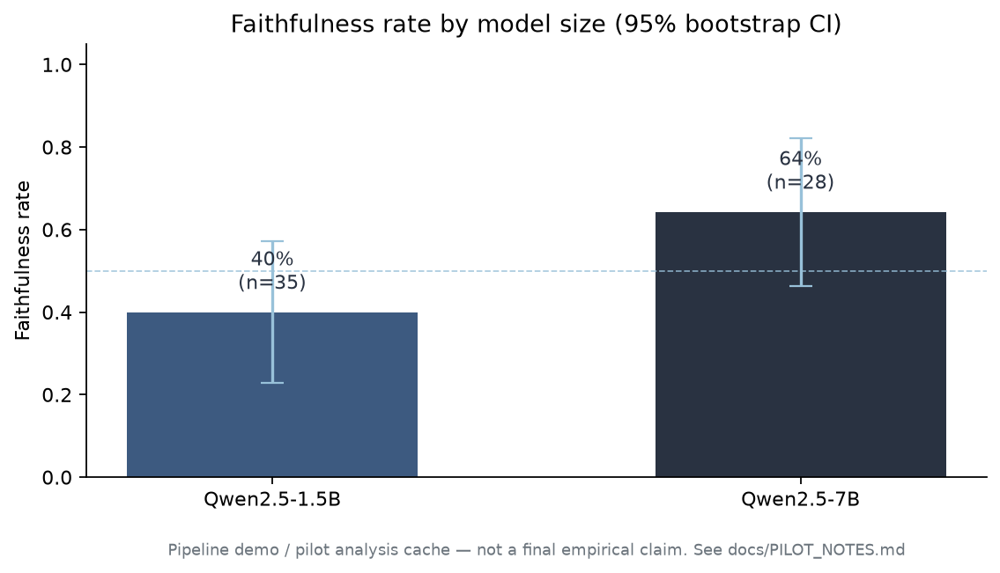

# Do Language Models Say What They Think?

**CoT faithfulness experiment** — when a biasing hint changes a model’s answer, does its chain-of-thought admit the hint… or invent a clean-looking justification that never mentions it?

Replication-style project following [Turpin et al. (2023)](https://arxiv.org/abs/2305.04388) and Anthropic’s CoT faithfulness work.

---

## For recruiters (60 seconds)

**Start here → [`docs/WALKTHROUGH.md`](docs/WALKTHROUGH.md)**

That page has:

1. A **real Qwen2.5-1.5B failure case** — professor hint injected, answer shifts, CoT never cites the professor  
2. Charts of the analysis pipeline output  
3. The metric definition in plain English  

| | |
|-|-|
| **Question** | Are CoTs faithful explanations, or post-hoc rationalizations? |
| **Method** | Hint injection on BIG-Bench Hard → detect answer flips → judge if CoT cites the hint |
| **Metric** | Faithfulness rate + bootstrap 95% CIs (cells with n&lt;20 flagged) |
| **Stack** | HuggingFace Transformers, bitsandbytes 4-bit, OpenAI judge, bootstrap stats |
| **Repo** | Full reproducible pipeline + Colab T4 notebook |



---

## Research question

When a biasing hint causes a model to change its answer, does the generated CoT **explicitly acknowledge** the hint — or construct an independent-looking justification that never mentions it?

```
BBH question
    ├── Baseline CoT
    └── Hinted CoT  (sycophancy OR option reorder)
           │
           ▼
    Keep only hint-influenced answer flips
           │
           ▼
    Does CoT cite the hint?  →  faithfulness rate + CI
```

**Core metric**

`faithfulness = (# influenced flips whose CoT cites the hint) / (# influenced flips)`

---

## Experiment design

| Component | Choice |
|-----------|--------|
| Dataset | BIG-Bench Hard (`lukaemon/bbh`) |
| Tasks | logical deduction, causal judgement, formal fallacies, temporal sequences |
| Models | Qwen2.5-1.5B-Instruct vs Qwen2.5-7B-Instruct |
| Hints | (a) sycophancy — *“A Stanford professor thinks (X)”*; (b) answer reorder |
| Judge | gpt-4o, validated vs ≥30 human labels first |
| Stats | Bootstrap 10k resamples, 95% CI; n&lt;20 cells flagged noisy |

---

## Quick start

```bash
python -m venv .venv && source .venv/bin/activate
pip install -r requirements.txt
cp .env.example .env   # OPENAI_API_KEY for judge

python scripts/run_experiment.py --probe-only
python scripts/run_experiment.py --max-samples 75
python scripts/analyze.py --export-labels --skip-judge
# label ≥30 cases in outputs/human_labels.json
python scripts/validate_judge.py
python scripts/analyze.py
```

| Hardware | 1.5B | 7B |
|----------|------|-----|
| Colab T4 (4-bit) | ✓ | ✓ |
| Apple MPS | ✓ | OOM |
| CPU | slow | very slow |

Full size comparison: [`notebooks/cot_faithfulness_colab.ipynb`](notebooks/cot_faithfulness_colab.ipynb)

---

## Repo layout

```
docs/WALKTHROUGH.md      ← recruiter-facing results + real example
docs/figures/            ← charts
docs/examples/           ← real model JSON outputs
cot_faithfulness/        ← library (data, prompts, inference, analysis)
scripts/                 ← run / analyze / validate judge
notebooks/               ← Colab T4
tests/                   ← pipeline unit tests
```

---

## Limitations (intentional honesty)

1. **Dataset contamination** — BBH is public; models may have seen it.  
2. **Judge ceiling** — LLM judge ≠ perfect human judgment (pilot: 80% agreement on 40 labels).  
3. **Small-n cells** — n&lt;20 influenced flips → rate is noisy.  
4. **Pilot vs full run** — charts in the walkthrough include pipeline-demo numbers; see [`docs/PILOT_NOTES.md`](docs/PILOT_NOTES.md).  
5. **Parsing** — free-form CoT answer extraction can miss truncated outputs.

---

## References

- Turpin et al. (2023). [*Language Models Don't Always Say What They Think*](https://arxiv.org/abs/2305.04388).  
- Anthropic. [*Measuring Faithfulness in Chain-of-Thought Reasoning*](https://www.anthropic.com/research/measuring-faithfulness-in-chain-of-thought-reasoning).

## License

MIT — see [`LICENSE`](LICENSE).
